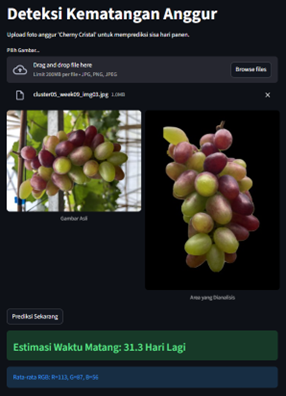
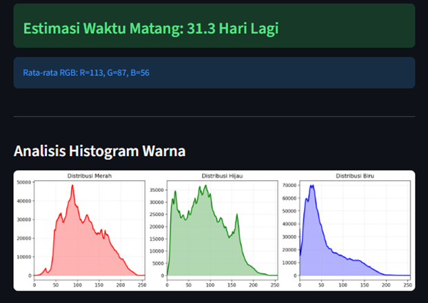

# Computer Vision Segmentation + Regression Web App

## Overview

This is a simple project app to predict the ripeness time of grape, specifically Cherny Crystal, using YOLO as object segmentation model and XGBoost as regression model for the prediction.

Users will only need to upload an image of Cherny Crystal cluster, hit Predict and receive a prediction generated by a trained regression model based on its color.

---

## Demo (Streamlit App)

This project includes an interactive web interface built with Streamlit.

To launch the app locally:

Open Terminal and run the command:

```bash
streamlit run app.py
```

Then open the provided local URL in your browser.

---

## Features

* Upload images directly through a web interface
* Object segmentation using YOLO
* Automatic feature extraction from segmented regions
* Prediction using XGBoost regression model

## Pipeline Architecture

User Upload Image (Streamlit UI) -> YOLO Segmentation (segmentation.pt) -> Feature Extraction (pixel RGB value) -> Regression Model (xgboost_rgb_model.pkl) -> Prediction Displayed in Web UI

---

## Project Structure

```
.
├── app.py                 # Streamlit web application
├── segmentation.pt        # YOLO segmentation model
├── xgboost_rgb_model.pkl  # Regression model (XGBoost)
├── requirements.txt       # Install dependencies
└── README.md              # Documentation
```

---

## Installation

1. Clone the repository:

```bash
git clone https://github.com/K1KC/grape-ripeness-prediction.git
cd grape-ripeness-prediction
```

2. Install dependencies:

```bash
pip install -r requirements.txt
```

Or install manually:

```bash
pip install streamlit ultralytics opencv-python numpy scikit-learn xgboost
```

---

## Usage

Run the Streamlit app:

```bash
streamlit run app.py
```

### Steps:

1. Upload an image
2. The app performs segmentation
3. Features are extracted automatically
4. Prediction is displayed in the UI

---

## Example Output

### Demo


### Histogram of RGB Value of the Grape


---

## Model Details

### YOLO Segmentation

* Custom-trained model (`segmentation.pt`)
* Detects and segments objects of grape

### Regression Model

* Model: XGBoost Regressor (`xgboost_rgb_model.pkl`)
* Input: Features extracted from segmentation
* Output: Continuous prediction

---

## Author

@K1KC
@winnieee14

---
